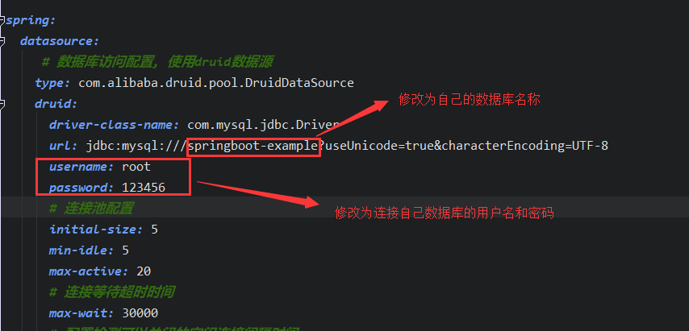
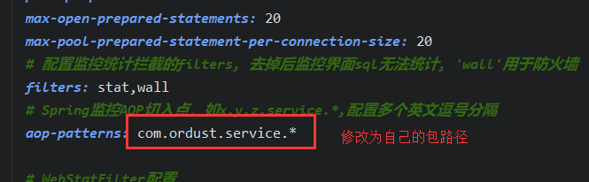
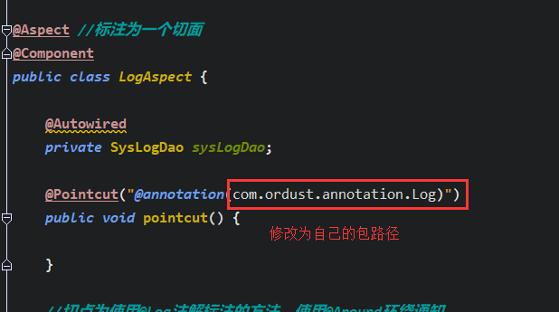
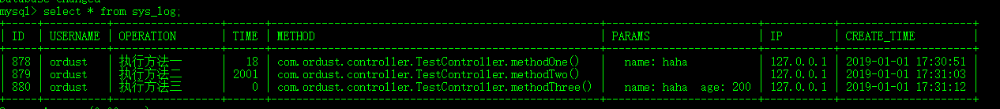

[前言](#前言)

[开发环境](#开发环境)

[导入项目注意事项](#导入项目注意事项)

[Spring Boot AOP记录用户操作日志](#spring-boot-aop记录用户操作日志)

### 前言

使用前先把整个项目下载下来，先运行再看源码。

### 开发环境

1. 基础框架 spring boot 2.0.4.RELEASE
2. 数据库：MySQL5.6
3. 数据库连接池：Druid 1.1.10
4. 语言：jdk1.8

### 导入项目注意事项

1. application.yaml

   

   

2. LogAspect.java

   


### Spring Boot AOP记录用户操作日志

> 在 spring boot 使用AOP配合自定义注解可以方便的实现用户操作的监控。

1. 导入依赖：

   ```xml
   <dependencies>
   
       <!--spring boot web模块依赖-->
       <dependency>
           <groupId>org.springframework.boot</groupId>
           <artifactId>spring-boot-starter-web</artifactId>
       </dependency>
   
       <!--spring boot测试-->
       <dependency>
           <groupId>org.springframework.boot</groupId>
           <artifactId>spring-boot-starter-test</artifactId>
           <scope>test</scope>
       </dependency>
   
       <dependency>
           <groupId>org.springframework.boot</groupId>
           <artifactId>spring-boot-starter-jdbc</artifactId>
       </dependency>
   
       <!-- aop依赖 -->
       <dependency>
           <groupId>org.springframework.boot</groupId>
           <artifactId>spring-boot-starter-aop</artifactId>
       </dependency>
   
       <!--mysql驱动-->
       <dependency>
           <groupId>mysql</groupId>
           <artifactId>mysql-connector-java</artifactId>
           <version>5.1.47</version>
       </dependency>
   
       <!--druid数据源驱动-->
       <dependency>
           <groupId>com.alibaba</groupId>
           <artifactId>druid-spring-boot-starter</artifactId>
           <version>1.1.10</version>
       </dependency>
   </dependencies>
   ```

2. 创建数据库、数据表和实体类

   - 在数据库中创建名为  `sys_log`  的数据表，用来保存用户的操作日志

     ```mysql
     CREATE TABLE `sys_log` (
       `ID` bigint(20) NOT NULL AUTO_INCREMENT COMMENT '日志ID',
       `USERNAME` varchar(50) DEFAULT NULL COMMENT '操作用户',
       `OPERATION` text COMMENT '操作内容',
       `TIME` decimal(11,0) DEFAULT NULL COMMENT '耗时',
       `METHOD` text COMMENT '操作方法',
       `PARAMS` text COMMENT '方法参数',
       `IP` varchar(64) DEFAULT NULL COMMENT '操作者IP',
       `CREATE_TIME` datetime DEFAULT NULL COMMENT '创建时间',
       PRIMARY KEY (`ID`)
     ) ENGINE=InnoDB AUTO_INCREMENT=878 DEFAULT CHARSET=utf8;
     ```

   - 创建表对应的实体类

     ```java
     import java.io.Serializable;
     import java.util.Date;
     
     public class SysLog implements Serializable {
     
         private static final long serialVersionUID = 8246438395115884862L;
     
         private Integer id;
         private String username; //用户名
         private String operation; //用户操作
         private Integer time; //响应时间
         private String method; //请求方法
         private String params; //请求参数
         private String ip; //ip 地址
         private Date createTime; //创建时间
         
         //省略对应的 setter、getter、toString 方法
     }
     ```

3. 持久层

   - 定义一个 `SysLogDao` 接口，包含一个保存操作日志的抽象方法

     ```java
     import com.ordust.domain.SysLog;
     
     public interface SysLogDao {
         /*保存日志*/
         void saveLog(SysLog sysLog);
     }
     ```

   - 实现 `SysLogDao` 接口，为了使用方便，使用 Spring JdbcTemplate 来操作数据库

     ```java
     import com.ordust.dao.SysLogDao;
     import com.ordust.domain.SysLog;
     import org.springframework.beans.factory.annotation.Autowired;
     import org.springframework.jdbc.core.JdbcTemplate;
     import org.springframework.jdbc.core.namedparam.BeanPropertySqlParameterSource;
     import org.springframework.jdbc.core.namedparam.NamedParameterJdbcTemplate;
     import org.springframework.stereotype.Repository;
     
     @Repository("sysLogDao")
     public class SysLogDaoImpl implements SysLogDao {
     
         @Autowired
         private JdbcTemplate jdbcTemplate;
     
         @Override
         public void saveLog(SysLog sysLog) {
             StringBuffer sql = new StringBuffer("insert into sys_log ");
             sql.append("(id,username,operation,time,method,params,ip,create_time) ");
             sql.append("values(:id,:username,:operation,:time,:method,");
             sql.append(":params,:ip,:createTime)");
     
             NamedParameterJdbcTemplate namedParameterJdbcTemplate = new NamedParameterJdbcTemplate(this.jdbcTemplate.getDataSource());
             namedParameterJdbcTemplate.update(sql.toString(), new BeanPropertySqlParameterSource(sysLog));
         }
     }
     ```

4. 定义切点、切面

   - 定义一个 LogAspect 类，使用注解 `@Aspect` 让其成为前面，定义使用 `@Log` 注解标注的方法为切点，使用 `@Around` 实现环绕通知：

     ```java
     import com.ordust.annotation.Log;
     import com.ordust.dao.SysLogDao;
     import com.ordust.domain.SysLog;
     
     import java.lang.reflect.Method;
     import java.util.Date;
     
     import javax.servlet.http.HttpServletRequest;
     
     import com.ordust.util.HttpContextUtils;
     import com.ordust.util.IPUtils;
     import org.aspectj.lang.ProceedingJoinPoint;
     import org.aspectj.lang.annotation.Around;
     import org.aspectj.lang.annotation.Aspect;
     import org.aspectj.lang.annotation.Pointcut;
     import org.aspectj.lang.reflect.MethodSignature;
     import org.springframework.beans.factory.annotation.Autowired;
     import org.springframework.core.LocalVariableTableParameterNameDiscoverer;
     import org.springframework.stereotype.Component;
     
     
     @Aspect //标注为一个切面
     @Component
     public class LogAspect {
     
         @Autowired
         private SysLogDao sysLogDao;
     
         //使 @Log 注解标注的方法成为切点
         @Pointcut("@annotation(com.ordust.annotation.Log)")
         public void pointcut() {
     
         }
     
         //使用@Around环绕通知
         @Around("pointcut()")
         public void around(ProceedingJoinPoint point) {
             long beginTime = System.currentTimeMillis();
             try {
                 // 执行方法
                 point.proceed();
             } catch (Throwable e) {
                 e.printStackTrace();
             }
             // 执行时长(毫秒)
             long time = System.currentTimeMillis() - beginTime;
             // 保存日志
             saveLog(point, time);
         }
     
         private void saveLog(ProceedingJoinPoint joinPoint, long time) {
             MethodSignature signature = (MethodSignature) joinPoint.getSignature();
             Method method = signature.getMethod();
             SysLog sysLog = new SysLog();
             Log logAnnotation = method.getAnnotation(Log.class);
             if (logAnnotation != null) {
                 // 注解上的描述
                 sysLog.setOperation(logAnnotation.value());
             }
             // 请求的方法名
             String className = joinPoint.getTarget().getClass().getName();
             String methodName = signature.getName();
             sysLog.setMethod(className + "." + methodName + "()");
             // 请求的方法参数值
             Object[] args = joinPoint.getArgs();
             // 请求的方法参数名称
             LocalVariableTableParameterNameDiscoverer u = new LocalVariableTableParameterNameDiscoverer();
             String[] paramNames = u.getParameterNames(method);
             if (args != null && paramNames != null) {
                 String params = "";
                 for (int i = 0; i < args.length; i++) {
                     params += "  " + paramNames[i] + ": " + args[i];
                 }
                 sysLog.setParams(params);
             }
             // 获取request
             HttpServletRequest request = HttpContextUtils.getHttpServletRequest();
             // 设置IP地址
             sysLog.setIp(IPUtils.getIpAddress(request));
             // 模拟一个用户名
             sysLog.setUsername("ordust");
             sysLog.setTime((int) time);
             Date date = new Date();
             sysLog.setCreateTime(date);
             // 保存系统日志
             sysLogDao.saveLog(sysLog);
         }
         
     }
     ```

5. 测试

   - 定义一个 TestController 测试

     ```java
     import com.ordust.annotation.Log;
     import org.springframework.web.bind.annotation.GetMapping;
     import org.springframework.web.bind.annotation.RestController;
     
     @RestController
     public class TestController {
     
         @Log("执行方法一")
         @GetMapping("/one")
         public void methodOne(String name) {
     
         }
     
         @Log("执行方法二")
         @GetMapping("/two")
         public void methodTwo() throws InterruptedException {
             Thread.sleep(2000);
         }
     
         @Log("执行方法三")
         @GetMapping("/three")
         public void methodThree(String name, String age) {
     
         }
     }
     ```

6. 启动项目后，分别访问一下三个路径：

   - `http://localhost:8080/web/one?name=haha`
   - `http://localhost:8080/web/two`
   - `http://localhost:8080/web/three?name=haha&age=200`

7. 查询数据库

   


> 参考博客：https://mrbird.cc/Spring-Boot-AOP%20log.html


