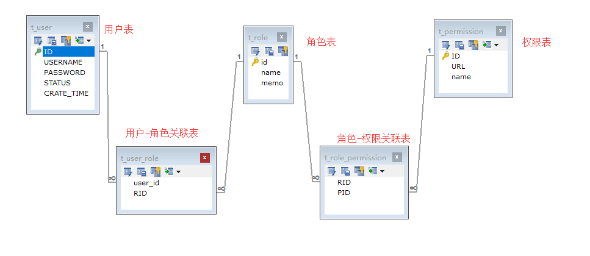

[TOC]

### Spring Boot Shiro权限控制

> 以下代码更改建立在 [Spring Boot Shiro用户认证](https://github.com/orduster/spring-boot-examples/tree/master/spring-boot-shiro-authentication) 或者 [spring-boot-shiro-remeberme](https://github.com/orduster/spring-boot-examples/tree/master/spring-boot-shiro-remeberme)

1. 在 Spring Boot Shiro 用户认证中，自定义 Realm 继承AuthorizingRealm类，通过 `doGetAuthenticationInfo()`  方法实现了登录认证，现在 需要实现 `doGetAuthorizationInfo()` 方法完成 shiro 的权限控制功能。
2. 授权也称为访问控制，是管理资源访问的过程。即根据不同用户的权限判断其是否有访问相应资源的权限。在Shiro中，权限控制有三个核心的元素：权限，角色和用户。


#### 设计库模型

1. 使用 RBAC（Role-Based Access Control，基于角色的访问控制）模型设计用户、角色和权限间的关系。一个用户拥有若干角色，每一个角色拥有若干权限。这样，就构造成“用户-角色-权限”的授权模型。在这种模型中，用户与角色之间，角色与权限之间，一般者是多对多的关系。如下图所示：

   

2. 创建数据表，并初始化一些数据：

   ```mysql
   DROP TABLE IF EXISTS `t_permission`;
   
   CREATE TABLE `t_permission` (
     `ID` bigint(20) NOT NULL AUTO_INCREMENT,
     `URL` varchar(255) DEFAULT NULL COMMENT 'url地址',
     `name` varchar(64) DEFAULT NULL COMMENT 'url描述',
     PRIMARY KEY (`ID`)
   ) ENGINE=InnoDB AUTO_INCREMENT=4 DEFAULT CHARSET=utf8;
   
   insert  into `t_permission`(`ID`,`URL`,`name`) values (1,'/user','user:user'),(2,'/user/add','user:add'),(3,'/user/delete','user:delete');
   
   
   DROP TABLE IF EXISTS `t_role`;
   
   CREATE TABLE `t_role` (
     `id` bigint(20) NOT NULL AUTO_INCREMENT,
     `name` varchar(32) DEFAULT NULL COMMENT '角色名称',
     `memo` varchar(32) DEFAULT NULL COMMENT '角色描述',
     PRIMARY KEY (`id`)
   ) ENGINE=InnoDB AUTO_INCREMENT=3 DEFAULT CHARSET=utf8;
   
   insert  into `t_role`(`id`,`name`,`memo`) values (1,'admin','超级管理员'),(2,'test','测试用户 ');
   
   
   DROP TABLE IF EXISTS `t_role_permission`;
   
   CREATE TABLE `t_role_permission` (
     `RID` bigint(20) DEFAULT NULL COMMENT '角色id',
     `PID` bigint(20) DEFAULT NULL COMMENT '权限id',
     KEY `RID` (`RID`),
     KEY `PID` (`PID`),
     CONSTRAINT `t_role_permission_ibfk_1` FOREIGN KEY (`RID`) REFERENCES `t_role` (`id`),
     CONSTRAINT `t_role_permission_ibfk_2` FOREIGN KEY (`PID`) REFERENCES `t_permission` (`ID`)
   ) ENGINE=InnoDB DEFAULT CHARSET=utf8;
   
   insert  into `t_role_permission`(`RID`,`PID`) values (1,2),(1,3),(1,1),(2,1);
   
   
   DROP TABLE IF EXISTS `t_user`;
   
   CREATE TABLE `t_user` (
     `ID` bigint(20) NOT NULL AUTO_INCREMENT COMMENT '用户ID',
     `USERNAME` varchar(50) NOT NULL COMMENT '用户名',
     `PASSWORD` varchar(128) NOT NULL COMMENT '密码',
     `STATUS` char(1) NOT NULL COMMENT '状态 0锁定 1有效',
     `CRATE_TIME` date NOT NULL COMMENT '创建时间',
     PRIMARY KEY (`ID`)
   ) ENGINE=InnoDB AUTO_INCREMENT=3 DEFAULT CHARSET=utf8;
   
   insert  into `t_user`(`ID`,`USERNAME`,`PASSWORD`,`STATUS`,`CRATE_TIME`) values (1,'ordust','93e4a60023701f52b8e8cb50472ff210','1','2018-12-31'),(2,'12345','cd1191e3c54919fc5fed64516bbb53fe','1','2018-12-31');
   
   
   DROP TABLE IF EXISTS `t_user_role`;
   
   CREATE TABLE `t_user_role` (
     `user_id` bigint(20) DEFAULT NULL COMMENT '用户id',
     `RID` bigint(20) DEFAULT NULL COMMENT '角色id',
     KEY `user_id` (`user_id`),
     KEY `RID` (`RID`),
     CONSTRAINT `t_user_role_ibfk_1` FOREIGN KEY (`user_id`) REFERENCES `t_user` (`ID`),
     CONSTRAINT `t_user_role_ibfk_2` FOREIGN KEY (`RID`) REFERENCES `t_role` (`id`)
   ) ENGINE=InnoDB DEFAULT CHARSET=utf8;
   
   insert  into `t_user_role`(`user_id`,`RID`) values (1,1),(2,2);
   ```


#### 实体层：

- 创建两个实体类：

  - Role：

    ```java
    import java.io.Serializable;
    
    public class Role implements Serializable {
    
        private static final long serialVersionUID = -1973745100040949051L;
    
        private Integer id;
        private String name;
        private String memo;
    	
        //省略 setter、getter、toString 方法
    }
    
    ```

  - Permission：

    ```java
    import java.io.Serializable;
    
    public class Permission implements Serializable {
    
        private static final long serialVersionUID = -1182862132695541227L;
    
        private Integer id;
        private String url;
        private String name;
    
     	//省略 setter、getter、toString 方法
    }
    ```


#### 持久层

1. 创建两个 dao 接口，分别为查询用户所有角色和用户的所有权限

   - UserRoleMapper：

     ```java
     import com.ordust.entity.Role;
     import org.apache.ibatis.annotations.Mapper;
     
     import java.util.List;
     
     /**
      * 查询用户的所有角色
      */
     @Mapper
     public interface UserRoleMapper {
         List<Role> findByUserName(String userName);
     }
     ```

   - UserPermissionMapper：

     ```java
     import com.ordust.entity.Permission;
     import org.apache.ibatis.annotations.Mapper;
     
     import java.util.List;
     
     /**
      * 查询用户的所有权限
      */
     @Mapper
     public interface UserPermissionMapper {
         List<Permission> findByUserName(String userName);
     }
     ```

2.  dao 接口的 xml 实现

   - UserRoleMapper.xml：

     ```xml
     <?xml version="1.0" encoding="UTF-8"?>
     <!DOCTYPE mapper PUBLIC "-//mybatis.org//DTD Mapper 3.0//EN" "http://mybatis.org/dtd/mybatis-3-mapper.dtd">
     <mapper namespace="com.ordust.dao.UserRoleMapper">
         <resultMap type="com.ordust.entity.Role" id="role">
             <id column="id" property="id" javaType="java.lang.Integer" jdbcType="BIGINT"/>
             <id column="name" property="name" javaType="java.lang.String" jdbcType="VARCHAR"/>
             <id column="memo" property="memo" javaType="java.lang.String" jdbcType="VARCHAR"/>
         </resultMap>
         <select id="findByUserName" resultMap="role">
             select r.id,r.name,r.memo from t_role r
             left join t_user_role ur on(r.id = ur.rid)
             left join t_user u on(u.id = ur.user_id)
             where u.username = #{userName}
         </select>
     </mapper>
     ```

   - UserPermissionMapper.xml：

     ```xml
     <?xml version="1.0" encoding="UTF-8"?>
     <!DOCTYPE mapper PUBLIC "-//mybatis.org//DTD Mapper 3.0//EN" "http://mybatis.org/dtd/mybatis-3-mapper.dtd">
     <mapper namespace="com.ordust.dao.UserPermissionMapper">
         <resultMap type="com.ordust.entity.Permission" id="permission">
             <id column="id" property="id" javaType="java.lang.Integer" jdbcType="BIGINT"/>
             <id column="url" property="url" javaType="java.lang.String" jdbcType="VARCHAR"/>
             <id column="name" property="name" javaType="java.lang.String" jdbcType="VARCHAR"/>
         </resultMap>
         <select id="findByUserName" resultMap="permission">
             select p.id,p.url,p.name from t_role r
             left join t_user_role ur on(r.id = ur.rid)
             left join t_user u on(u.id = ur.user_id)
             left join t_role_permission rp on(rp.rid = r.id)
             left join t_permission p on(p.id = rp.pid )
             where u.username = #{userName}
         </select>
     </mapper>
     ```


#### 改变 Realm 

1. 在Shiro中，用户角色和权限的获取是在Realm的 `doGetAuthorizationInfo()` 方法中实现的，所以接下来手动实现该方法：

   ```java
   import com.ordust.dao.UserMapper;
   import com.ordust.dao.UserPermissionMapper;
   import com.ordust.dao.UserRoleMapper;
   import com.ordust.entity.Permission;
   import com.ordust.entity.Role;
   import com.ordust.entity.User;
   import org.apache.shiro.SecurityUtils;
   import org.apache.shiro.authc.*;
   import org.apache.shiro.authz.AuthorizationInfo;
   import org.apache.shiro.authz.SimpleAuthorizationInfo;
   import org.apache.shiro.realm.AuthorizingRealm;
   import org.apache.shiro.subject.PrincipalCollection;
   import org.springframework.beans.factory.annotation.Autowired;
   
   import java.util.HashSet;
   import java.util.List;
   import java.util.Set;
   
   public class ShiroRealm extends AuthorizingRealm {
   
       @Autowired
       private UserMapper userMapper;
   
       @Autowired
       private UserRoleMapper userRoleMapper;
   
       @Autowired
       private UserPermissionMapper userPermissionMapper;
   
       /**
        * 获取用户角色和权限
        */
       @Override
       protected AuthorizationInfo doGetAuthorizationInfo(PrincipalCollection principals) {
           User user = (User) SecurityUtils.getSubject().getPrincipal();
           String userName = user.getUserName();
   
           System.out.println("用户" + userName + "获取权限-----ShiroRealm.doGetAuthorizationInfo");
   
           SimpleAuthorizationInfo simpleAuthorizationInfo = new SimpleAuthorizationInfo();
   
           //获取用户角色集
           List<Role> roleList = userRoleMapper.findByUserName(userName);
           Set<String> roleSet = new HashSet<>();
           for (Role role : roleList) {
               roleSet.add(role.getName());
           }
           simpleAuthorizationInfo.addRoles(roleSet);
   
           //获取用户权限集
           List<Permission> permissionList = userPermissionMapper.findByUserName(userName);
           Set<String> permissionSet = new HashSet<>();
           for (Permission permission : permissionList) {
               permissionSet.add(permission.getName());
           }
           simpleAuthorizationInfo.addStringPermissions(permissionSet);
   
           return simpleAuthorizationInfo;
       }
   
       /**
        * 验证用户的合法性
        */
       @Override
       protected AuthenticationInfo doGetAuthenticationInfo(AuthenticationToken token) throws AuthenticationException {
          //登录认证已经实现过，此处省略
       }
   }
   ```


#### ShiroConfig

1. Shiro为我们提供了一些和权限相关的注解，如下所示：

   ```java
   // 表示当前Subject已经通过login进行了身份验证；即Subject.isAuthenticated()返回true。
   @RequiresAuthentication  
    
   // 表示当前Subject已经身份验证或者通过记住我登录的。
   @RequiresUser  
   
   // 表示当前Subject没有身份验证或通过记住我登录过，即是游客身份。
   @RequiresGuest  
   
   // 表示当前Subject需要角色admin和user。  
   @RequiresRoles(value={"admin", "user"}, logical= Logical.AND)  
   
   // 表示当前Subject需要权限user:a或user:b。
   @RequiresPermissions (value={"user:a", "user:b"}, logical= Logical.OR)
   ```

2. 要开启上面的注解，需要在 ShiroConfig 中添加如下代码：

   ```java
   @Bean
   @DependsOn({"lifecycleBeanPostProcessor"})
   public DefaultAdvisorAutoProxyCreator advisorAutoProxyCreator() {
       DefaultAdvisorAutoProxyCreator advisorAutoProxyCreator = new DefaultAdvisorAutoProxyCreator();
       advisorAutoProxyCreator.setProxyTargetClass(true);
       return advisorAutoProxyCreator;
   }
   
   @Bean
   public AuthorizationAttributeSourceAdvisor authorizationAttributeSourceAdvisor(SecurityManager securityManager) {
       AuthorizationAttributeSourceAdvisor authorizationAttributeSourceAdvisor = new AuthorizationAttributeSourceAdvisor();
       authorizationAttributeSourceAdvisor.setSecurityManager(securityManager);
       return authorizationAttributeSourceAdvisor;
   }
   ```


#### 控制层

1. 处理User类的访问请求，并使用Shiro权限注解控制权限 — UserController

   ```java
   import org.apache.shiro.authz.annotation.RequiresPermissions;
   import org.springframework.stereotype.Controller;
   import org.springframework.ui.Model;
   import org.springframework.web.bind.annotation.RequestMapping;
   
   @Controller
   @RequestMapping("/user")
   public class UserController {
   
       @RequestMapping("list")
       @RequiresPermissions("user:user")
       public String userList(Model model) {
           model.addAttribute("value", "获取用户信息");
           return "user";
       }
   
       @RequiresPermissions("user:add")
       @RequestMapping("add")
       public String userAdd(Model model) {
           model.addAttribute("value", "新增用户");
           return "user";
       }
   
       @RequestMapping("delete")
       @RequiresPermissions("user:delete")
       public String userDelete(Model model) {
           model.addAttribute("value", "删除用户");
           return "user";
       }
   }
   ```

2. 在 LoginController 中添加一个 /403 跳转

   ```java
   @RequestMapping("/403")
   public String forbid() {
       return "403";
   }
   ```

3. 添加一个 全局异常处理，当权限不够时捕获异常：

   ```java
   import org.apache.shiro.authz.AuthorizationException;
   import org.springframework.core.Ordered;
   import org.springframework.core.annotation.Order;
   import org.springframework.web.bind.annotation.ControllerAdvice;
   import org.springframework.web.bind.annotation.ExceptionHandler;
   
   @ControllerAdvice
   @Order(value = Ordered.HIGHEST_PRECEDENCE)
   public class GlobalExceptionHandler {
   
       @ExceptionHandler(value = AuthorizationException.class)
       public String handleAuthorizationException() {
           return "403";
       }
   }
   ```


#### 前端页面

- 对 index.html 进行改造，添加三个用户操作的链接：

  ```html
  <!doctype html>
  <html lang="zh-cn" xmlns:th="http://www.thymeleaf.org">
  <head>
      <meta charset="UTF-8">
      <meta name="viewport"
            content="width=device-width, user-scalable=no, initial-scale=1.0, maximum-scale=1.0, minimum-scale=1.0">
      <meta http-equiv="X-UA-Compatible" content="ie=edge">
      <title>首页</title>
  </head>
  <body>
  <p>你好！[[${user.userName}]]</p>
  <a th:href="@{/logout}">注销</a>
  
  <h3>权限测试链接</h3>
  <div>
      <a th:href="@{/user/list}">获取用户信息</a>
      <a th:href="@{/user/add}">新增用户</a>
      <a th:href="@{/user/delete}">删除用户</a>
  </div>
  </body>
  </html>
  ```

- 当用户对用户的操作有相应权限的时候，跳转到user.html：

  ```html
  <!doctype html>
  <html lang="zh-cn" xmlns:th="http://www.thymeleaf.org">
  <head>
      <meta charset="UTF-8">
      <meta name="viewport"
            content="width=device-width, user-scalable=no, initial-scale=1.0, maximum-scale=1.0, minimum-scale=1.0">
      <meta http-equiv="X-UA-Compatible" content="ie=edge">
      <title>[[${value}]]</title>
  </head>
  <body>
  <p>[[${value}]]</p>
  <a th:href="@{/index}">返回</a>
  </body>
  </html>
  ```

- 403页面：

  ```html
  <!doctype html>
  <html lang="zh-cn" xmlns:th="http://www.thymeleaf.org">
  <head>
      <meta charset="UTF-8">
      <meta name="viewport"
            content="width=device-width, user-scalable=no, initial-scale=1.0, maximum-scale=1.0, minimum-scale=1.0">
      <meta http-equiv="X-UA-Compatible" content="ie=edge">
      <title>暂无权限</title>
  </head>
  <body>
  <p>您没有权限访问该资源！！</p>
  <a th:href="@{/index}">返回</a>
  </body>
  </html>
  ```

> 参考博文：https://mrbird.cc/Spring-Boot-Shiro%20Authorization.html
