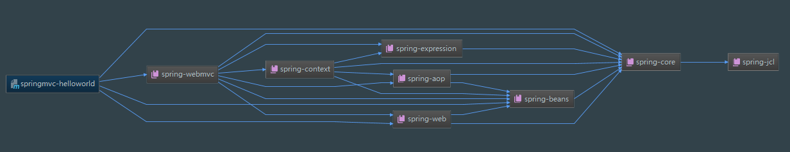
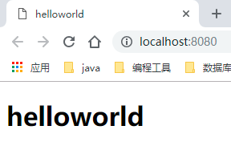

### springmvc-helloworld


#### 1. 导入 jar 包

```xml
<properties>
    <spring-version>5.0.8.RELEASE</spring-version>
</properties>

<dependencies>
    <dependency>
        <groupId>org.springframework</groupId>
        <artifactId>spring-core</artifactId>
        <version>${spring-version}</version>
    </dependency>
    <dependency>
        <groupId>org.springframework</groupId>
        <artifactId>spring-beans</artifactId>
        <version>${spring-version}</version>
    </dependency>
    <dependency>
        <groupId>org.springframework</groupId>
        <artifactId>spring-web</artifactId>
        <version>${spring-version}</version>
    </dependency>
    <dependency>
        <groupId>org.springframework</groupId>
        <artifactId>spring-webmvc</artifactId>
        <version>${spring-version}</version>
    </dependency>
</dependencies>
```




#### 2. 编写 web.xml 文件

- 配置 DispatcherServlet ：DispatcherServlet 默认加载 ` /WEBINF/<servletName-servlet>.xml ` 的 Spring 配置文件, 启动 WEB 层的 Spring 容器。可以通过 **contextConfigLocation** 初始化参数自定义配置文件的位置和名称 : 

  ```xml
  <web-app xmlns="http://xmlns.jcp.org/xml/ns/javaee" xmlns:xsi="http://www.w3.org/2001/XMLSchema-instance"
           xsi:schemaLocation="http://xmlns.jcp.org/xml/ns/javaee
                        http://xmlns.jcp.org/xml/ns/javaee/web-app_3_1.xsd"
           version="3.1" metadata-complete="true">
  
      <!--配置 DispatcherServlet-->
      <servlet>
          <servlet-name>springDispatcherServlet</servlet-name>
          <servlet-class>org.springframework.web.servlet.DispatcherServlet</servlet-class>
          <!--配置 DispatcherServlet 的初始化参数：配置spingmvc配置文件的位置和名称-->
          <init-param>
              <param-name>contextConfigLocation</param-name>
              <param-value>classpath:spring-mvc.xml</param-value>
          </init-param>
          <load-on-startup>1</load-on-startup>
      </servlet>
      <servlet-mapping>
          <servlet-name>springDispatcherServlet</servlet-name>
          <url-pattern>/</url-pattern>
      </servlet-mapping>
  
  </web-app>
  ```


#### 3. 编写 spring mvc 的配置文件：spring-mvc.xml

> 此处文件名需要和 web.xml 中定义的 spring mvc 的文件名一致

```xml
<?xml version="1.0" encoding="UTF-8"?>
<beans xmlns="http://www.springframework.org/schema/beans"
       xmlns:xsi="http://www.w3.org/2001/XMLSchema-instance"
       xmlns:context="http://www.springframework.org/schema/context"
       xmlns:mvc="http://www.springframework.org/schema/mvc"
       xsi:schemaLocation="http://www.springframework.org/schema/beans http://www.springframework.org/schema/beans/spring-beans.xsd
		http://www.springframework.org/schema/context http://www.springframework.org/schema/context/spring-context-4.0.xsd
		http://www.springframework.org/schema/mvc http://www.springframework.org/schema/mvc/spring-mvc-4.0.xsd">

    <!--配置自动扫描包-->
    <context:component-scan base-package="com.ordust"/>

    <!--配置视图解析器：视图名称解析器：将视图逻辑名解析为 /WEB-INF/views/<viewName>.jsp-->
    <bean class="org.springframework.web.servlet.view.InternalResourceViewResolver">
        <property name="prefix" value="/WEB-INF/views/"/>
        <property name="suffix" value=".jsp"/>
    </bean>
</beans>
```


#### 4. 创建请求处理类：HelloWorld 

```java
import org.springframework.stereotype.Controller;
import org.springframework.web.bind.annotation.*;

@Controller
public class HelloWorld {

    @RequestMapping("/")
    public String helloWorld() {
        return "helloworld";
    }

}
```


#### 5. 创建视图：helloworld.jsp

```html
<%@ page contentType="text/html;charset=UTF-8" language="java" %>
<!doctype html>
<html lang="en">
<head>
    <meta charset="UTF-8">
    <meta name="viewport"
          content="width=device-width, user-scalable=no, initial-scale=1.0, maximum-scale=1.0, minimum-scale=1.0">
    <meta http-equiv="X-UA-Compatible" content="ie=edge">
    <title>helloworld</title>
</head>
<body>
<h1>helloworld</h1>
</body>
</html>
```


#### 6. 结果



#### 7. 小结

- 在 web.xml 中指定 spring mvc 配置文件名称和位置，配置 DispatcherServlet 启动 WEB 层 的 spring 容器。
- 在 spring mvc 配置文件中配置自动扫描的包，扫描的包中要是有 @Component @Controller@Service等这些注解的类，则把这些类注册为bean
- 在 spring mvc 配置文件中配置视图解析器，将将视图逻辑名解析为 /WEB-INF/views/\<viewName>.jsp

