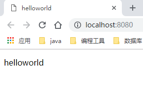

### springmvc-thymeleaf

#### 1. 导入 jar 包

```xml
<properties>
    <spring-version>5.0.8.RELEASE</spring-version>
    <thymeleaf.version>3.0.11.RELEASE</thymeleaf.version>
    <thymeleaf-spring5.version>3.0.11.RELEASE</thymeleaf-spring5.version>
</properties>

<dependencies>

    <!--springmvc start-->
    <dependency>
        <groupId>org.springframework</groupId>
        <artifactId>spring-core</artifactId>
        <version>${spring-version}</version>
    </dependency>
    <dependency>
        <groupId>org.springframework</groupId>
        <artifactId>spring-beans</artifactId>
        <version>${spring-version}</version>
    </dependency>
    <dependency>
        <groupId>org.springframework</groupId>
        <artifactId>spring-web</artifactId>
        <version>${spring-version}</version>
    </dependency>
    <dependency>
        <groupId>org.springframework</groupId>
        <artifactId>spring-webmvc</artifactId>
        <version>${spring-version}</version>
    </dependency>
    <!--springmvc end-->

    <!--thymeleaf start-->
    <dependency>
        <groupId>org.thymeleaf</groupId>
        <artifactId>thymeleaf</artifactId>
        <version>${thymeleaf.version}</version>
    </dependency>
    <dependency>
        <groupId>org.thymeleaf</groupId>
        <artifactId>thymeleaf-spring5</artifactId>
        <version>${thymeleaf-spring5.version}</version>
    </dependency>
    <!--thymeleaf end-->
</dependencies>
```


#### 2. 编写 web.xml 文件

```xml
<web-app xmlns="http://xmlns.jcp.org/xml/ns/javaee" xmlns:xsi="http://www.w3.org/2001/XMLSchema-instance"
         xsi:schemaLocation="http://xmlns.jcp.org/xml/ns/javaee
                      http://xmlns.jcp.org/xml/ns/javaee/web-app_3_1.xsd"
         version="3.1" metadata-complete="true">

    <!--spring mvc核心：分发servlet，拦截所有请求  -->
    <servlet>
        <servlet-name>dispatcherServlet</servlet-name>
        <servlet-class>org.springframework.web.servlet.DispatcherServlet</servlet-class>
        <init-param>
            <description>spring mvc 配置文件</description>
            <param-name>contextConfigLocation</param-name>
            <param-value>classpath:spring-mvc.xml</param-value>
        </init-param>
        <load-on-startup>1</load-on-startup>
    </servlet>
    <servlet-mapping>
        <servlet-name>dispatcherServlet</servlet-name>
        <url-pattern>/</url-pattern>
    </servlet-mapping>
</web-app>
```


#### 编写 spring mvc 的配置文件：spring-mvc.xml

```xml
<?xml version="1.0" encoding="UTF-8"?>
<beans xmlns="http://www.springframework.org/schema/beans"
       xmlns:xsi="http://www.w3.org/2001/XMLSchema-instance"
       xmlns:context="http://www.springframework.org/schema/context"
       xmlns:mvc="http://www.springframework.org/schema/mvc"
       xsi:schemaLocation="http://www.springframework.org/schema/beans http://www.springframework.org/schema/beans/spring-beans.xsd
		http://www.springframework.org/schema/mvc http://www.springframework.org/schema/mvc/spring-mvc-4.0.xsd
		http://www.springframework.org/schema/context http://www.springframework.org/schema/context/spring-context-4.0.xsd">

    <!--SpringMVC的配置文件，包含网站跳转逻辑的控制，配置  -->
    <context:component-scan base-package="com.ordust"/>

    <!--模板解析器，thymeleaf-->
    <bean id="templateResolver" class="org.thymeleaf.spring5.templateresolver.SpringResourceTemplateResolver">
        <property name="prefix" value="/WEB-INF/views/"/>
        <property name="suffix" value=".html"/>
        <property name="templateMode" value="HTML5"/>
        <property name="cacheable" value="false"/>
        <property name="characterEncoding" value="UTF-8"/>
        <property name="order" value="1"/>
    </bean>

    <bean id="templateEngine" class="org.thymeleaf.spring5.SpringTemplateEngine">
        <property name="templateResolver" ref="templateResolver"/>
    </bean>

    <bean id="viewResolver" class="org.thymeleaf.spring5.view.ThymeleafViewResolver">
        <property name="templateEngine" ref="templateEngine"/>
        <property name="characterEncoding" value="UTF-8"/>
    </bean>

    <!--两个标准配置  -->
    <!-- 将springmvc不能处理的请求交给tomcat -->
    <mvc:default-servlet-handler/>
    <!-- 能支持springmvc更高级的一些功能，JSR303校验，快捷的ajax...映射动态请求 -->
    <mvc:annotation-driven/>

</beans>
```


#### 4. 创建请求处理类：HelloWorld

```java
import org.springframework.stereotype.Controller;
import org.springframework.ui.Model;
import org.springframework.web.bind.annotation.RequestMapping;

@Controller
public class HelloWorld {

    @RequestMapping("/")
    public String helloworld(Model model) {
        model.addAttribute("helloworld", "helloworld");
        return "helloworld";
    }

}
```


#### 5. 创建视图：helloworld.html

```html
<!doctype html>
<html lang="zh-cn" xmlns:th="http://www.thymeleaf.org">
<head>
    <meta charset="UTF-8">
    <meta name="viewport"
          content="width=device-width, user-scalable=no, initial-scale=1.0, maximum-scale=1.0, minimum-scale=1.0">
    <meta http-equiv="X-UA-Compatible" content="ie=edge">
    <title>helloworld</title>
</head>
<body>
<p>[[${helloworld}]]</p>
</body>
</html>
```

#### 6. 结果




#### 7. 小结

- springmvc 配置 thymeleaf 基本流程和配置 jsp 是一样的，最大的区别在于配置的视图解析器不同，配置 jsp 使用的解析器为 `org.springframework.web.servlet.view.InternalResourceViewResolver` ，配置 thymeleaf 的解析器为 `org.thymeleaf.spring5.templateresolver.SpringResourceTemplateResolver`

